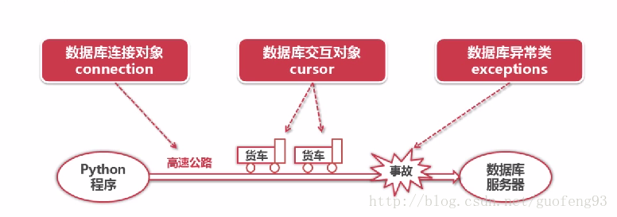

## sql 原理

####   [cursor  游标解释]( https://www.cnblogs.com/zhouziyuan/p/10155612.html )

  

  

## 语法

#### [数据类型格式化函数]( https://www.runoob.com/manual/PostgreSQL/functions-formatting.html )

| 函数                              | 返回类型                   | 描述                     | 例子                                           |
| --------------------------------- | -------------------------- | ------------------------ | ---------------------------------------------- |
| `to_char(timestamp, text)`        | `text`                     | 把时间戳转成字符串       | `to_char(current_timestamp, 'HH12:MI:SS')`     |
| `to_char(interval, text)`         | `text`                     | 把间隔转成字符串         | `to_char(interval '15h 2m 12s', 'HH24:MI:SS')` |
| `to_char(int, text)`              | `text`                     | 把整数转成字符串         | `to_char(125, '999')`                          |
| `to_char(double precision, text)` | `text`                     | 把实数或双精度转成字符串 | `to_char(125.8::real, '999D9')`                |
| `to_char(numeric, text)`          | `text`                     | 把数字转成字符串         | `to_char(-125.8, '999D99S')`                   |
| `to_date(text, text)`             | `date`                     | 把字符串转成日期         | `to_date('05 Dec 2000', 'DD Mon YYYY')`        |
| `to_number(text, text)`           | `numeric`                  | 把字符串转成数字         | `to_number('12,454.8-', '99G999D9S')`          |
| `to_timestamp(text, text)`        | `timestamp with time zone` | 把字符串转成时间戳       | `to_timestamp('05 Dec 2000', 'DD Mon YYYY')`   |


#### similar to 

```python
similar to '%aaa%|%bbb%'
```


#### [with](https://www.runoob.com/postgresql/postgresql-with.html )

在 PostgreSQL 中，WITH 子句提供了一种编写辅助语句的方法，以便在更大的查询中使用。

WITH 子句有助于将复杂的大型查询分解为更简单的表单，便于阅读。这些语句通常称为通用表表达式（Common Table Express， CTE），也可以当做一个为查询而存在的临时表。

WITH 子句是在多次执行子查询时特别有用，允许我们在查询中通过它的名称(可能是多次)引用它。

WITH 子句在使用前必须先定义。

```python
WITH
   name_for_summary_data AS (
      SELECT Statement)
   SELECT columns
   FROM name_for_summary_data
   WHERE conditions <=> (
      SELECT column
      FROM name_for_summary_data)
   [ORDER BY columns]
```


#### [排序让空值靠后](https://www.cnblogs.com/sunxun/p/6802989.html)

**Oracle/Pgsql** 
`order by colum asc` 时，null默认被放在最后
`order by colum desc `时，null默认被放在最前
`nulls first` 时，强制null放在最前，不为null的按声明顺序[asc|desc]进行排序
`nulls last` 时，强制null放在最后，不为null的按声明顺序[asc|desc]进行排序 


**MySql**
`order by colum asc` 时，null默认被放在最前
`order by colum desc `时，null默认被放在最后
`ORDER BY IF(ISNULL(update_date),0,1)` null被强制放在最前，不为null的按声明顺序[asc|desc]进行排序
`ORDER BY IF(ISNULL(update_date),1,0)` null被强制放在最后，不为null的按声明顺序[asc|desc]进行排序

### 分组聚合

#### grouping set 分组集

```mysql
# 分别按照brand，size，和合计做group by 操作
SELECT brand, size, sum(sales) FROM items_sold GROUP BY GROUPING SETS ((brand), (size), ());
```

#### rollup

```MYSQL
ROLLUP ( e1, e2, e3, ... )

# 等价于
GROUPING SETS (
    ( e1, e2, e3, ... ),
    ...
    ( e1, e2 ),
    ( e1 ),
    ( )
)
```

#### cube

```mysql
CUBE ( a, b, c )

# 等价于
GROUPING SETS (
    ( a, b, c ),
    ( a, b    ),
    ( a,    c ),
    ( a       ),
    (    b, c ),
    (    b    ),
    (       c ),
    (         )
)
```

### 日期时间

#### 计算时间间隔 AGE()

```MYSQL
select AGE('2018-08-31', '2018-10-15')  # 返回间隔X年X月X日，配合extract
```


#### EXTRACT()

| `DAY`                | 返回日期值       |
| -------------------- | ---------------- |
| `MONTH`              | 返回月份值       |
| `YEAR`               | 返回年份值       |
| `DOY`（day of year） | 返回年中的第几天 |
| `DOW`（day of week） | 返回星期几       |
| `QUARTER`            | 返回季度         |

```PYTHON
EXTRACT(type FROM d)
```


#### DATEPART()

DATEPART(datepart,date)

| datepart | 缩写     |
| :------- | :------- |
| 年       | yy, yyyy |
| 季度     | qq, q    |
| 月       | mm, m    |
| 年中的日 | dy, y    |
| 日       | dd, d    |
| 周       | wk, ww   |
| 星期     | dw, w    |
| 小时     | hh       |
| 分钟     | mi, n    |
| 秒       | ss, s    |
| 毫秒     | ms       |
| 微妙     | mcs      |
| 纳秒     | ns       |

```SQL
SELECT DATEPART(yyyy,OrderDate) AS OrderYear,
DATEPART(mm,OrderDate) AS OrderMonth,
DATEPART(dd,OrderDate) AS OrderDay,
FROM Orders
WHERE OrderId=1
```


### [窗口函数](http://postgres.cn/docs/10/tutorial-window.html)

和groupby不同， 窗口函数并不会使多行被聚集成一个单独的输出行 ，而是保留和原来一样的行数

 一个窗口函数调用总是包含一个直接跟在窗口函数名及其参数之后的`OVER`子句。

`OVER`子句决定究竟查询中的哪些行被分离出来由窗口函数处理。

`OVER`子句中的`PARTITION BY`子句指定了将具有相同`PARTITION BY`表达式值的行分到组或者分区。对于每一行，窗口函数都会在当前行同一分区的行上进行计算。 

 通过`OVER`上的`ORDER BY`控制窗口函数处理行的顺序（窗口的`ORDER BY`并不一定要符合行输出的顺序。） 

```mysql
# 每一个窗口行为可以被放在一个命名的WINDOW子句中，然后在OVER中引用它
SELECT sum(salary) OVER w, avg(salary) OVER w
FROM empsalary
WINDOW w AS (PARTITION BY depname ORDER BY salary DESC);
  
# 配合rank函数
SELECT depname, empno, salary,
       rank() OVER (PARTITION BY depname ORDER BY salary DESC) 
FROM empsalary;
  
```

#### 窗口函数结果进行筛选

```MYSQL
SELECT depname, empno, salary, enroll_date
FROM
  (SELECT depname, empno, salary, enroll_date,
          rank() OVER (PARTITION BY depname ORDER BY salary DESC, empno) AS pos
     FROM empsalary
  ) AS ss
WHERE pos < 3;
```


#### 线性回归 regr_slope(Y, X)

```PYTHON
SELECT
    prd_type_id,
    REGR_SLOPE(amount, month) AS slope
FROM all_sales
GROUP BY prd_type_id;
```


### 字段类型

#### [类型转换相关函数](https://www.runoob.com/postgresql/postgresql-functions.html)

| 函数                            | 返回类型  | 描述                                                        | 实例                                         |
| :------------------------------ | :-------- | :---------------------------------------------------------- | :------------------------------------------- |
| to_char(timestamp, text)        | text      | 将时间戳转换为字符串                                        | to_char(current_timestamp, 'HH12:MI:SS')     |
| to_char(interval, text)         | text      | 将时间间隔转换为字符串                                      | to_char(interval '15h 2m 12s', 'HH24:MI:SS') |
| to_char(int, text)              | text      | 整型转换为字符串                                            | to_char(125, '999')                          |
| to_char(double precision, text) | text      | 双精度转换为字符串                                          | to_char(125.8::real, '999D9')                |
| to_char(numeric, text)          | text      | 数字转换为字符串                                            | to_char(-125.8, '999D99S')                   |
| to_date(text, text)             | date      | 字符串转换为日期                                            | to_date('05 Dec 2000', 'DD Mon YYYY')        |
| to_number(text, text)           | numeric   | 转换字符串为数字                                            | to_number('12,454.8-', '99G999D9S')          |
| to_timestamp(text, text)        | timestamp | 转换为指定的时间格式 time zone convert string to time stamp | to_timestamp('05 Dec 2000', 'DD Mon YYYY')   |
| to_timestamp(double precision)  | timestamp | 把UNIX纪元转换成时间戳                                      | to_timestamp(1284352323)                     |


#### 字符转数字

to_number()

```sql
select sum(to_number(mj,9999.99)) as amountmj
from table 
group by area
```

cast()

```sql
select cast('123' as INTEGER);
CAST('123.11' as NUMERIC)
```


### 字符串


### 其他函数

#### LEAST 取最小值

```SQL
SELECT LEAST(a, b)
```


## 系统表

### information_schema

information_schema 可以看作是一个信息数据库， 如数据库名，数据库的表，表栏的数据类型与访问权限等数据库信息。  和`pg_`开头的系统表不同，information_schema 属于标准sql的一部分，MySQL，SQL Server同样有information_schema这个schema。 

#### 字段信息 columns 

| `table_catalog`            | `sql_identifier`  | 包含表的数据库的名字（总是当前数据库）                       |
| :------------------------- | :---------------- | :----------------------------------------------------------- |
| 名字                       | 数据类型          | 描述                                                         |
| `table_schema`             | `sql_identifier`  | 包含表的模式的名字                                           |
| `table_name`               | `sql_identifier`  | 表名                                                         |
| `column_name`              | `sql_identifier`  | 字段名                                                       |
| `ordinal_position`         | `cardinal_number` | 字段在表中的位置序号（从 1 开始）                            |
| `column_default`           | `character_data`  | 字段的缺省表达式                                             |
| `is_nullable`              | `yes_or_no`       | 如果字段可能为空，则为`YES`，如果知道它不能为空，则为`NO`。 非空约束是我们得知字段不能为空的一个手段， 但是还可能有其它的。 |
| `data_type`                | `character_data`  | 如果它是一个内置类型，那么为字段的数据类型，如果它是某种数组， 则为`ARRAY`（在这种情况下，参阅视图 `element_types`）， 否则就是`USER-DEFINED`。 |
| `character_maximum_length` | `cardinal_number` | 如果`data_type`标识一个字符或者位串类型，声明的最大长度；    |
| `numeric_precision`        | `cardinal_number` | 如果`data_type`标识一个数值类型，这个字段包含（声明了或者蕴涵着）这个 字段的数据类型的精度。 精度表示有效小数位的长度。它可以用十进制或者二进制来表示，这一点在 `numeric_precision_radix`字段里声明。对于其它数据类型，这个字段是空。 |

```SQL
select column_name from information_schema.columns where table_schema = '' and table_name = ''
```

#### 数据库表信息 tables

| 名称            | 数据类型         | 描述                                                         |
| :-------------- | :--------------- | :----------------------------------------------------------- |
| `table_catalog` | `sql_identifier` | 包含该表的数据库名（总是当前数据库）                         |
| `table_schema`  | `sql_identifier` | 包含该表的模式名                                             |
| `table_name`    | `sql_identifier` | 表名                                                         |
| `table_type`    | `character_data` | 表的类型：永久基本表是`BASE TABLE`（普通的表类型）， 视图是`VIEW`，或者是`LOCAL TEMPORARY`表示临时表。 |


### [系统表](https://www.php.cn/manual/view/20898.html)

| 表名           | 用途                         |
| :------------- | :--------------------------- |
| `pg_class`     | 表、索引、序列、视图("关系") |
| `pg_tables`    | 提供关于数据库表的信息       |
| `pg_namespace` | 存储名空间                   |

#### pg_class

| 名称            | 类型     | 引用                | 描述                                                         |
| :-------------- | :------- | :------------------ | :----------------------------------------------------------- |
| `relname`       | `name`   |                     | 表、索引、视图等的名字。                                     |
| `relnamespace`  | `oid`    | `pg_namespace.oid`  | 包含这个关系的名字空间(模式)的OID                            |
| `reltype`       | `oid`    | `pg_type.oid`       | 对应这个表的行类型的数据类型(索引为零，它们没有`pg_type`记录)。 |
| `reloftype`     | `oid`    | `pg_type.oid`       | 对于类型表，复合类型的OID，所有其他关系为零。                |
| `relowner`      | `oid`    | `pg_authid.oid`     | 关系所有者                                                   |
| `reltablespace` | `oid`    | `pg_tablespace.oid` | 这个关系存储所在的表空间。如果为零，则意味着使用该数据库的缺省表空间。 如果关系在磁盘上没有文件，则这个字段没有什么意义。 |
| `relpages`      | `int4`   |                     | 以页(大小为`BLCKSZ`)的此表在磁盘上的形式的大小。它只是规划器用的一个估计值， 是由`VACUUM`, `ANALYZE`和几个DDL命令，比如`CREATE INDEX`更新。 |
| `reltuples`     | `float4` |                     | 表中行数。只是规划器使用的一个估计值，由`VACUUM`, `ANALYZE`和几个DDL命令，比如`CREATE INDEX`更新。 |
| `relhasindex`   | `bool`   |                     | 如果它是一个表而且至少有(或者最近有过)一个索引，则为真。     |
| `relisshared`   | `bool`   |                     | 如果该表在整个集群中由所有数据库共享则为真。只有某些系统表(比如`pg_database`)是共享的。 |
| `relkind`       | `char`   |                     | `r` = 普通表， `i` = 索引， `S` = 序列， `v` = 视图， `c` = 复合类型， `t` = TOAST表 |
| `relnatts`      | `int2`   |                     | 关系中用户字段数目(除了系统字段以外)。在`pg_attribute`里肯定有相同数目对应行。 又见`pg_attribute.attnum` |
| `relchecks`     | `int2`   |                     | 表里的检查约束的数目；参阅`pg_constraint`表                  |
| `relhasoids`    | `bool`   |                     | 如果为关系中每行都生成一个OID则为真                          |

#### [pg_tables](https://www.postgresql.org/docs/8.3/view-pg-tables.html)

| Name          | Type      | References              | Description                                                  |
| ------------- | --------- | ----------------------- | ------------------------------------------------------------ |
| `schemaname`  | `name`    | `pg_namespace.nspname`  | Name of schema containing table                              |
| `tablename`   | `name`    | `pg_class.relname`      | Name of table                                                |
| `tableowner`  | `name`    | `pg_authid.rolname`     | Name of table's owner                                        |
| `tablespace`  | `name`    | `pg_tablespace.spcname` | Name of tablespace containing table (NULL if default for database) |
| `hasindexes`  | `boolean` | `pg_class.relhasindex`  | true if table has (or recently had) any indexes              |
| `hasrules`    | `boolean` | `pg_class.relhasrules`  | true if table has rules                                      |
| `hastriggers` | `boolean` | `pg_class.reltriggers`  | true if table has triggers                                   |

#### pg_namespace

| 名称       | 类型        | 引用            | 描述                                    |
| :--------- | :---------- | :-------------- | :-------------------------------------- |
| `nspname`  | `name`      |                 | 名空间的名称                            |
| `nspowner` | `oid`       | `pg_authid.oid` | 名空间的所有者                          |
| `nspacl`   | `aclitem[]` |                 | 访问权限，请参阅 GRANT和 REVOKE获取详情 |

#### 查看数据库表名和行数
```sql
select 
    b.nspname as schemaname,
    a.relname as table_name,
    a.reltuples as rowcounts,
    c.tableowner, 
    c.tablespace,
    c.hasindexes
from pg_class a 
    left join pg_namespace b on a.relnamespace = b.oid
    left join pg_tables c on a.relname=c.tablename and b.nspname=c.schemaname
where a.relkind='r'
    and a.relname like ''
    and b.nspname='base_phjr_sz'
order by rowcounts desc
```

#### 查看表结构

```SQL
select
    col.table_schema,
    col.table_name,
    col.ordinal_position,
    col.column_name,
    col.data_type,
    col.character_maximum_length,
    col.numeric_precision,
    col.numeric_scale,
    col.is_nullable,
    col.column_default,
    des.description
from information_schema.columns col left join pg_description des 
    on col.table_name = des.objoid and col.ordinal_position = des.objsubid
where table_schema = 'public' 
    and table_name = 't_student'
order by ordinal_position
```

#### 查看索引信息

```SQL
select
    A.SCHEMANAME,
    A.TABLENAME,
    A.INDEXNAME,
    A.TABLESPACE,
    A.INDEXDEF,
    B.AMNAME,
    C.INDEXRELID,
    C.INDNATTS,
    C.INDISUNIQUE,
    C.INDISPRIMARY,
    C.INDISCLUSTERED,
    D.DESCRIPTION
from PG_AM B 
    left join PG_CLASS F on B.OID = F.RELAM 
    left join PG_STAT_ALL_INDEXES E on F.OID = E.INDEXRELID 
    left join PG_INDEX C on E.INDEXRELID = C.INDEXRELID 
    left outer join PG_DESCRIPTION D on C.INDEXRELID = D.OBJOID, PG_INDEXES A
where
    A.SCHEMANAME = E.SCHEMANAME
    and A.TABLENAME = E.RELNAME
    and A.INDEXNAME = E.INDEXRELNAME
    and E.SCHEMANAME = 'public'
    and E.RELNAME = 't_student';
```


## 优化查询

#### [EXPLIAN](https://www.yiibai.com/manual/postgresql/using-explain.html)


