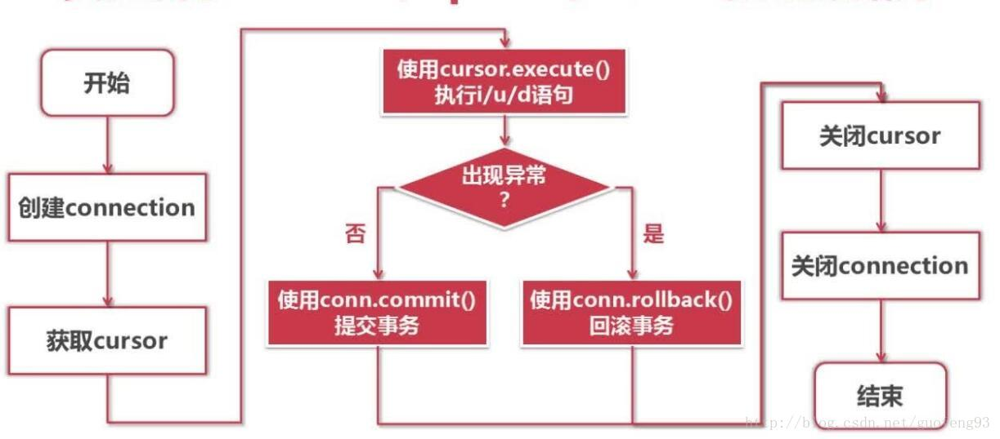

####   [cursor  游标解释]( https://www.cnblogs.com/zhouziyuan/p/10155612.html )

  

  

#### [数据类型格式化函数]( https://www.runoob.com/manual/PostgreSQL/functions-formatting.html )

| 函数                              | 返回类型                   | 描述                     | 例子                                           |
| --------------------------------- | -------------------------- | ------------------------ | ---------------------------------------------- |
| `to_char(timestamp, text)`        | `text`                     | 把时间戳转成字符串       | `to_char(current_timestamp, 'HH12:MI:SS')`     |
| `to_char(interval, text)`         | `text`                     | 把间隔转成字符串         | `to_char(interval '15h 2m 12s', 'HH24:MI:SS')` |
| `to_char(int, text)`              | `text`                     | 把整数转成字符串         | `to_char(125, '999')`                          |
| `to_char(double precision, text)` | `text`                     | 把实数或双精度转成字符串 | `to_char(125.8::real, '999D9')`                |
| `to_char(numeric, text)`          | `text`                     | 把数字转成字符串         | `to_char(-125.8, '999D99S')`                   |
| `to_date(text, text)`             | `date`                     | 把字符串转成日期         | `to_date('05 Dec 2000', 'DD Mon YYYY')`        |
| `to_number(text, text)`           | `numeric`                  | 把字符串转成数字         | `to_number('12,454.8-', '99G999D9S')`          |
| `to_timestamp(text, text)`        | `timestamp with time zone` | 把字符串转成时间戳       | `to_timestamp('05 Dec 2000', 'DD Mon YYYY')`   |

#### grouping set 分组集

```mysql
# 分别按照brand，size，和合计做group by 操作
SELECT brand, size, sum(sales) FROM items_sold GROUP BY GROUPING SETS ((brand), (size), ());
```

#### rollup

```MYSQL
ROLLUP ( e1, e2, e3, ... )

# 等价于
GROUPING SETS (
    ( e1, e2, e3, ... ),
    ...
    ( e1, e2 ),
    ( e1 ),
    ( )
)
```

#### cube

```mysql
CUBE ( a, b, c )

# 等价于
GROUPING SETS (
    ( a, b, c ),
    ( a, b    ),
    ( a,    c ),
    ( a       ),
    (    b, c ),
    (    b    ),
    (       c ),
    (         )
)
```

